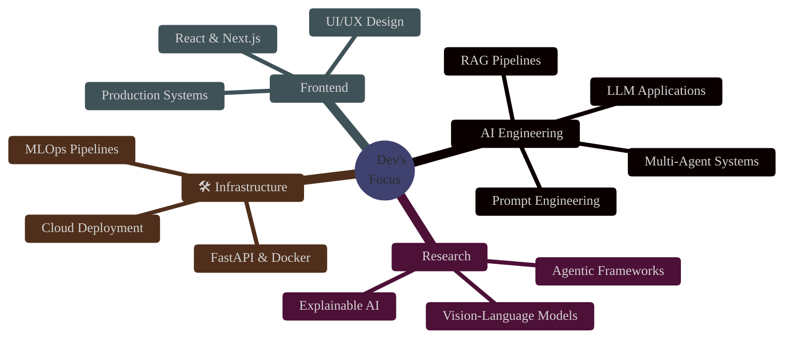

<div align="center">

<!-- ANIMATED SVG BANNER -->


<br/>

<!-- TYPING SVG -->
<a href="https://github.com/DevChiniwala">
  
</a>

<br/>

<!-- PROFILE BADGES -->
<a href="https://github.com/DevChiniwala"></a>

<a href="https://github.com/DevChiniwala?tab=repositories"></a>
<a href="https://github.com/DevChiniwala?tab=stars"></a>

</div>

<!-- ANIMATED DIVIDER -->


<!-- ═══════════════════════════════════════════════════════ -->
<!-- ABOUT ME -->
<!-- ═══════════════════════════════════════════════════════ -->



<table>
<tr>
<td width="55%">

```js
const dev = {
    name: "Dev Hiren Chiniwala",
    role: "AI Engineer & GenAI Explorer",
    location: "India 🇮🇳",
    currentFocus: [
        "Building AI Systems & GenAI Apps",
        "LLM Agents & RAG Pipelines",
        "Production-Grade Frontends",
        "AI Research & Analysis"
    ],
    funFact: "I think in systems, design in pixels,
              and ship in Python 🐍"
};
```

</td>
<td width="45%">

🔭 **Building** AI systems & GenAI applications that deliver real-world value

🧠 **Exploring** AI Engineering — LLMs, Agents, RAG pipelines & beyond

🎨 **Designing** pixel-perfect, production-grade UI/UX frontends

📊 **Researching** AI — turning insights into systems

🌱 **Learning** VLMs, Prompt Engineering & Agentic Frameworks

⚡ **Open to** collaborate on GenAI, AI Research & Full Frontend projects

</td>
</tr>
</table>

<!-- ANIMATED TERMINAL -->
<div align="center">

</div>

<br/>

<!-- ANIMATED DIVIDER -->


<!-- ═══════════════════════════════════════════════════════ -->
<!-- CURRENT FOCUS -->
<!-- ═══════════════════════════════════════════════════════ -->


<div align="center">



</div>

<br/>

<!-- ANIMATED DIVIDER -->


<!-- ═══════════════════════════════════════════════════════ -->
<!-- TECH STACK -->
<!-- ═══════════════════════════════════════════════════════ -->


<h4>🤖 AI / ML / Deep Learning</h4>

<p>
<a href="#"></a>
<a href="#"></a>
<a href="#"></a>
<a href="#"></a>
<a href="#"></a>
<a href="#"></a>
<a href="#"></a>
<a href="#"></a>
<a href="#"></a>
<a href="#"></a>
<a href="#"></a>
</p>

<h4>🎨 Frontend / UI-UX</h4>

<p>
<a href="#"></a>
<a href="#"></a>
<a href="#"></a>
<a href="#"></a>
<a href="#"></a>
<a href="#"></a>
<a href="#"></a>
<a href="#"></a>
<a href="#"></a>
</p>

<h4>⚙️ Backend / Tools / Platforms</h4>

<p>
<a href="#"></a>
<a href="#"></a>
<a href="#"></a>
<a href="#"></a>
<a href="#"></a>
<a href="#"></a>
<a href="#"></a>
<a href="#"></a>
</p>

<br/>

<!-- ANIMATED DIVIDER -->


<!-- ═══════════════════════════════════════════════════════ -->
<!-- FEATURED PROJECTS -->
<!-- ═══════════════════════════════════════════════════════ -->


<div align="center">

<table>
<tr>
<td width="50%" valign="top">

### 🤖 [NextGen-Trader](https://github.com/DevChiniwala/NextGen-Trader)
> Multi-agent AI trading system built with **LangGraph** and **Python**

<a href="https://github.com/DevChiniwala/NextGen-Trader">
  
</a>

`LangGraph` `Multi-Agent` `AI Trading` `Python`

</td>
<td width="50%" valign="top">

### 🔮 [NexusFlow](https://github.com/DevChiniwala/NexusFlow)
> Autonomous AI content engine with **modular workflows**

<a href="https://github.com/DevChiniwala/NexusFlow">
  
</a>

`Autonomous AI` `Content Engine` `Workflows`

</td>
</tr>
<tr>
<td width="50%" valign="top">

### 💰 [Price-Oracle](https://github.com/DevChiniwala/price-oracle)
> AI-powered **autonomous pricing intelligence** system with ML + explainability

<a href="https://github.com/DevChiniwala/price-oracle">
  
</a>

`ML` `Pricing Intelligence` `Explainable AI` `Python`

</td>
<td width="50%" valign="top">

### 🎯 [HireIQ](https://github.com/DevChiniwala/HireIQ)
> AI-powered hiring intelligence platform

<a href="https://github.com/DevChiniwala/HireIQ">
  
</a>

`AI Hiring` `Intelligence` `Python`

</td>
</tr>
</table>

</div>

<br/>

<!-- ANIMATED DIVIDER -->


<!-- ═══════════════════════════════════════════════════════ -->
<!-- GITHUB STATS -->
<!-- ═══════════════════════════════════════════════════════ -->


<div align="center">

<!-- Stats Cards Row -->
<a href="https://github.com/DevChiniwala">
  
</a>
<a href="https://github.com/DevChiniwala">
  
</a>

<br/>

<!-- Top Languages -->
<a href="https://github.com/DevChiniwala">
  
</a>

<br/><br/>

<!-- Activity Graph -->
<a href="https://github.com/DevChiniwala">
  
</a>

</div>

<br/>

<!-- ANIMATED DIVIDER -->


<!-- ═══════════════════════════════════════════════════════ -->
<!-- TROPHIES -->
<!-- ═══════════════════════════════════════════════════════ -->

<div align="center">

### 🏆 GitHub Trophies

<a href="https://github.com/DevChiniwala">
  
</a>

</div>

<br/>

<!-- ANIMATED DIVIDER -->


<!-- ═══════════════════════════════════════════════════════ -->
<!-- CONNECT -->
<!-- ═══════════════════════════════════════════════════════ -->


<div align="center">

<a href="https://www.linkedin.com/in/dev-chiniwala/" target="_blank">
  
</a>
<a href="https://x.com/DevChiniwala" target="_blank">
  
</a>
<a href="https://instagram.com/underscoredevv" target="_blank">
  
</a>
<a href="mailto:dev.chiniwala@gmail.com">
  
</a>
<a href="https://github.com/DevChiniwala" target="_blank">
  
</a>

<br/><br/>

### 👇 Hit in your console or terminal to connect with me

```bash
npx devcard0707
```

> 💡 This command line card can be found at [npx devcard0707](https://www.npmjs.com/package/devcard0707)

<br/>

### ✍️ Random Dev Quote


<br/><br/>

<!-- Contribution Details -->


<br/>


<br/><br/>

<!-- Snake Animation -->


</div>

<br/>

<!-- ═══════════════════════════════════════════════════════ -->
<!-- FOOTER -->
<!-- ═══════════════════════════════════════════════════════ -->



<div align="center">
  
</div>
